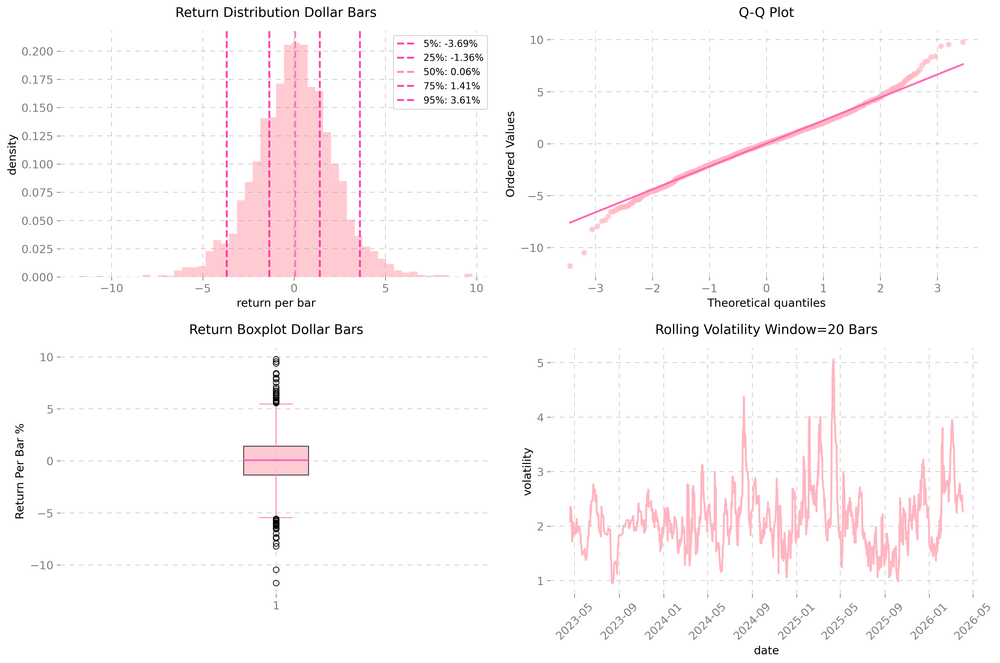
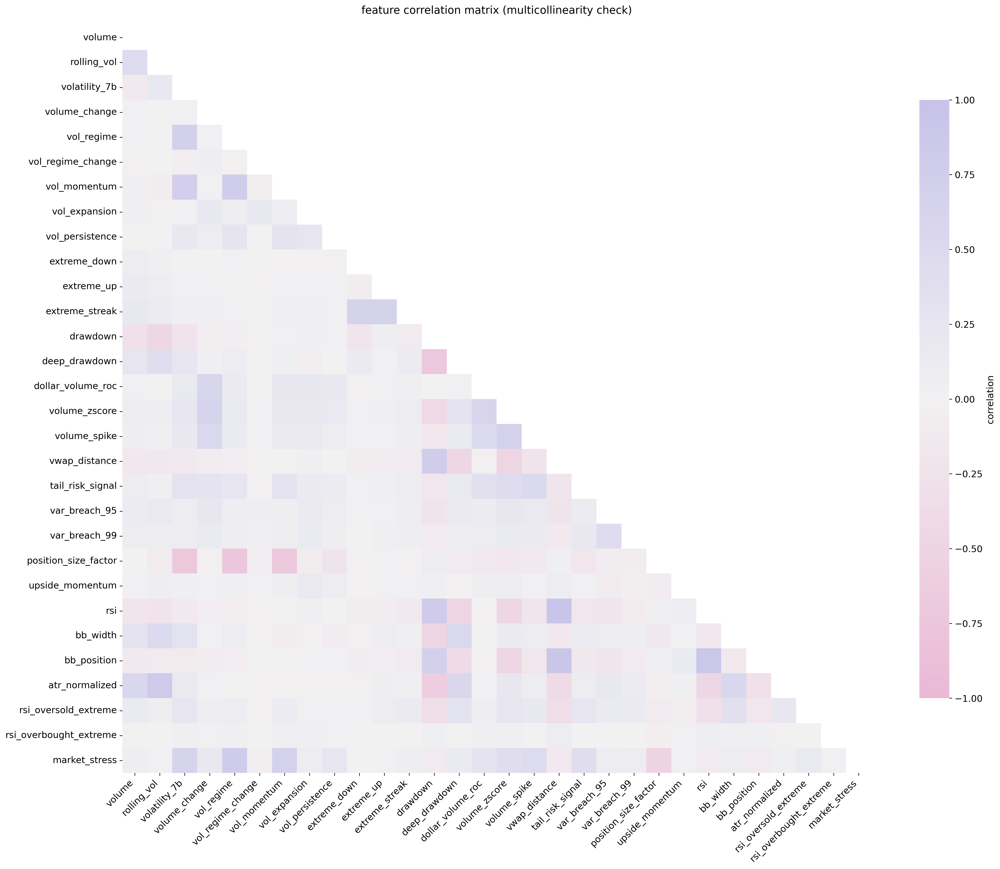
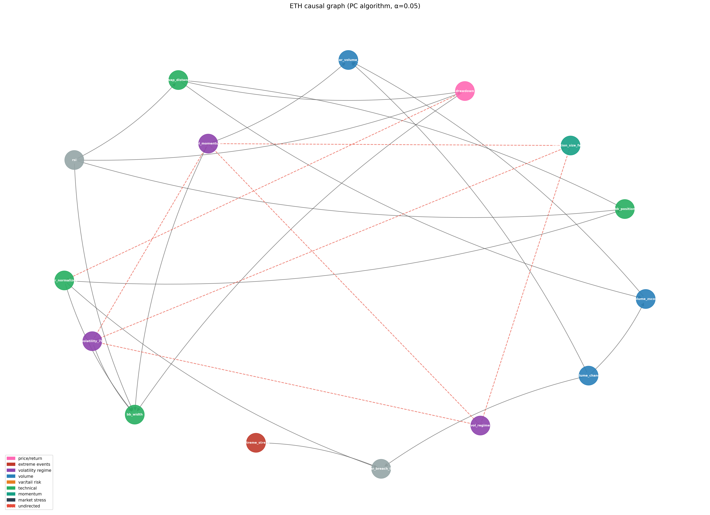
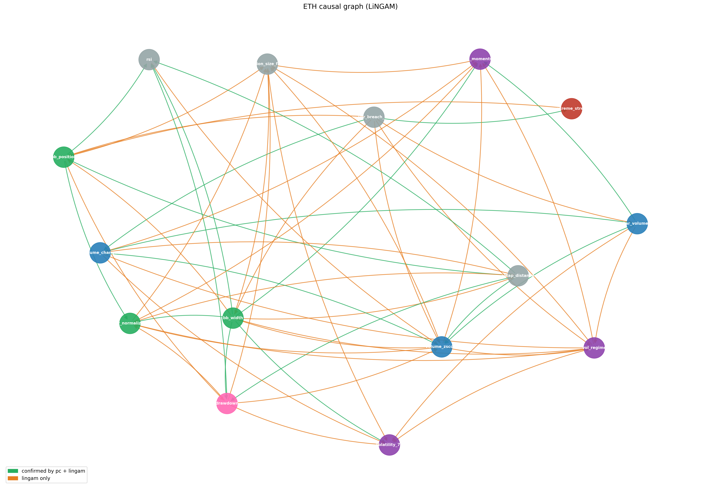
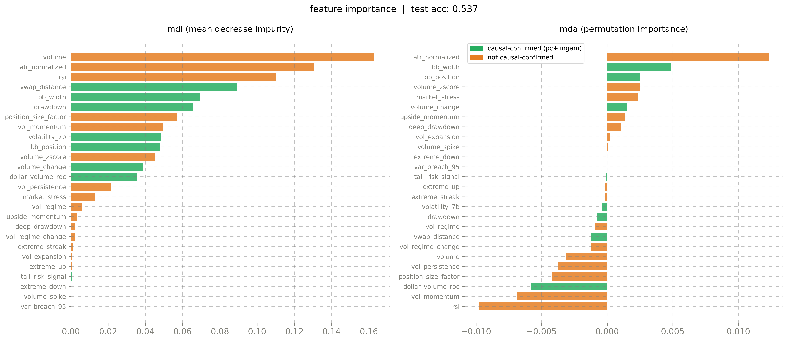
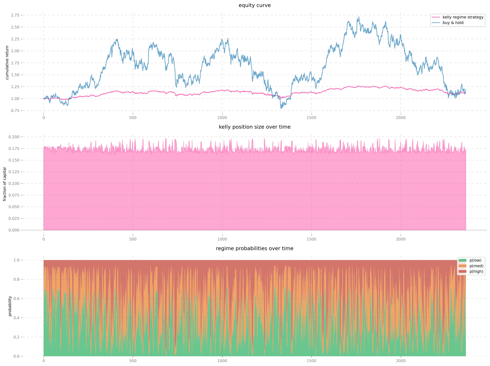

# UNDER CONSTRUCTION

# Regime-Conditioned Kelly Sizing on ETH: A De Prado ML Framework with Causal Discovery

## Overview

Marcos López de Prado argues that most machine learning models in finance fail not because of model complexity, but due to **spurious features** — statistical relationships that do not reflect the true data-generating process.

This project implements de Prado's ML framework on ETH/USDT, extended with causal discovery as a methodological guardrail. Rather than predicting price direction, the system predicts **volatility regimes** and sizes positions via fractional Kelly criterion conditioned on regime probabilities.

To address limitations of time-based sampling, the analysis is conducted on **dollar bars** ($500M threshold), which sample observations based on traded value rather than clock time. This reduces heteroskedasticity, improves serial independence of returns, and aligns data with actual market activity.

---

### Research Question

*Can a regime-conditioned Kelly sizing system built on causally-validated features produce a better risk-adjusted return than buy & hold on a highly volatile crypto asset?*

### Methodology

- **Dollar Bar Construction** — $500M threshold, 2319 bars over 3 years, validated via Durbin-Watson (1.95) and Ljung-Box (p > 0.4)
- **Feature Engineering** — volatility, volume, drawdown, technical and tail-risk features, all ADF-tested for stationarity
- **Correlation Analysis** — multicollinearity hygiene via clustering (threshold 0.85), not feature selection
- **Causal Discovery** — PC algorithm + LiNGAM to map feature dependency structure and identify true drivers vs downstream nodes
- **Triple Barrier Labeling** — PT = 1.5x ATR, SL = 1.0x ATR, max hold = 20 bars
- **Random Forest with Purged K-Fold CV** — n=5 folds, embargo=1%, prevents temporal leakage
- **MDI/MDA Feature Importance** — cross-referenced with causal graph to validate signal vs noise
- **Regime-Conditioned Kelly Sizing** — fractional Kelly (0.25x) applied per predicted regime probability

### Key Finding

Causal discovery and MDI/MDA produced **mutually explanatory results**. RSI ranked 3rd by MDI (in-sample importance) but last by MDA (out-of-sample). LiNGAM explained the mechanism: RSI is a pure downstream node driven by `vwap_distance`, `bb_width`, and `drawdown` — it carries no independent predictive signal. MDI was deceived by its correlation with genuine drivers. This cross-validation is the primary methodological contribution of the hybrid framework.

### Results (annualized, out-of-sample, no transaction costs)

| Metric | Strategy | Buy & Hold |
|---|---|---|
| Annual Return | 8.5% | 29.8% |
| Annual Volatility | 8.4% | 64.1% |
| Sharpe Ratio | **1.01** | 0.47 |
| Max Drawdown | **-9.5%** | -65.0% |
| Avg Capital Deployed | 11.3% | 100% |

The strategy sacrifices absolute return in exchange for dramatically reduced risk. Fold stability (accuracy 0.641–0.682, no degradation in most recent fold) confirms temporal generalization.

### Limitations

- Transaction costs not modeled (est. 0.05–0.1% per trade on Binance)
- No walk-forward retraining — model trained on fixed 3-year window
- Kelly inputs estimated from same dataset used for evaluation
- Paper trading validation required before any capital deployment

> This is a proof-of-concept, not a deployable system.

---

## Market Context: ETH Profile

### Distribution Characteristics

- **Slight positive mean return** (0.0275%) with positive median (0.0630%) indicates weak bullish drift in the sample period
- **Moderate volatility** (2.22% per bar) — more stable than time bars due to event-based sampling
- **Near-symmetric distribution** (skewness -0.03) indicates no strong directional asymmetry
- **Low excess kurtosis** (1.34) suggests fewer extreme events than typical time-bar crypto returns



### Tail Risk Profile

- **VaR 95%: -3.68%** — moderate downside risk per dollar-activity event
- **VaR 99%: -5.45%** — rare but meaningful tail losses under high-activity regimes

### Serial Independence Validation

Dollar bars are theoretically more i.i.d. than time bars. This was validated empirically:

- **Durbin-Watson: 1.95** — near-perfect, no lag-1 autocorrelation
- **Ljung-Box lag 10: p = 0.42** — no autocorrelation across first 10 lags
- **Ljung-Box lag 20: p = 0.71** — holds across 20 lags

This confirms the core motivation for dollar bars: returns are statistically independent, satisfying the assumption most ML models require.

---

## Feature Engineering

Features are grouped by domain and mapped to distributional properties of the return series:

| Domain | Features | Rationale |
|---|---|---|
| Volatility | `volatility_7b`, `vol_momentum`, `vol_expansion` | Activity-conditioned regime signals |
| Risk | `drawdown`, `deep_drawdown` | Tail risk per unit of traded value |
| Extremes | `extreme_down`, `extreme_streak` | Non-linear shock detection |
| Technical | `bb_width`, `atr_normalized`, `vwap_distance` | Latent market state proxies |
| Volume | `volume_change`, `volume_zscore` | Information flow and activity intensity |

All 30 features passed ADF stationarity testing. Binary features were validated for class balance — 4 features with under 3% positive class were dropped as uninformative.

---

## Correlation Analysis



Correlation analysis serves one purpose only: **multicollinearity hygiene**. Features are not selected or ranked here — that is MDI/MDA's job.

One cluster was identified at threshold 0.85: `vwap_distance`, `rsi`, `bb_position` (max correlation 0.93). All three measure "where is price relative to a reference" — `vwap_distance` was retained as volume-informed. Final selection deferred to MDI/MDA post-training.

---

## Causal Discovery as Feature Engineering Guardrail

Causal discovery (PC algorithm + LiNGAM) was used to map directional dependencies between features — identifying true drivers vs. downstream nodes before model training.

**Purpose:** Cross-validate MDI/MDA importance scores with structural causal evidence. Features that rank high in MDI but are causally downstream are flagged as noise candidates.

**What causal discovery does not do here:**
- It does not select features autonomously — MDI/MDA makes final decisions
- It does not establish definitive causal truth — it provides structural heuristics
- It does not replace domain knowledge — results are interpreted in context

**Temporal integrity:** `return` was excluded from the causal graph. All features entering the graph use `.shift(1)` to prevent look-ahead bias.

**PC Algorithm**



The PC algorithm identified 8 directed and 7 undirected edges across 15 features. Key structural findings:

- `bb_width` emerges as the largest causal hub — driving `volatility_7b`, `rsi`, `drawdown`, `vol_momentum`, and `volume_zscore`
- `vwap_distance` and `drawdown` are primary drivers of `rsi`, explaining why RSI carries no independent signal
- `vol_regime` — `volatility_7b` direction was ambiguous (undirected), resolved by LiNGAM

**LiNGAM Algorithm**



LiNGAM resolved directional ambiguity using non-Gaussianity. Key additions:

- Confirmed `vol_regime → volatility_7b` (strength 16.2) — regime drives realized volatility, not the reverse
- 18 edges confirmed by both PC and LiNGAM — treated as high-confidence causal structure
- `position_size_factor` identified as downstream of `atr_normalized`, `bb_width`, and `vol_regime`

---

## Triple Barrier Labeling & Feature Importance

**Triple Barrier Labeling** (de Prado, AFML ch. 3) replaces naive return-direction labels with structurally sound targets:

- **Upper barrier:** Profit target at 1.5x ATR
- **Lower barrier:** Stop-loss at 1.0x ATR
- **Vertical barrier:** Maximum hold of 20 bars

Label distribution: 52.5% stops hit, 47.2% profit targets hit, 0.3% timeouts — confirming ETH is volatile enough to always resolve within 20 bars. The near-balanced distribution eliminates the need for resampling.

**MDI vs MDA: The Core Diagnostic**



A Random Forest was trained on all stationary features with triple barrier labels as target. Two importance measures were computed and cross-referenced with causal discovery results:

- **MDI (Mean Decrease Impurity):** In-sample, computed from tree structure. Fast but biased toward high-cardinality and correlated features.
- **MDA (Mean Decrease Accuracy):** Out-of-sample permutation importance on held-out data. Slower but honest.

The gap between MDI and MDA revealed the key finding of this project:

| Feature | MDI Rank | MDA Rank | Verdict |
|---|---|---|---|
| `rsi` | 3 | 25 (last) | noise — causally downstream |
| `volume` | 1 | 24 | noise — no causal confirmation |
| `atr_normalized` | 2 | 1 | genuine signal |
| `bb_width` | 5 | 2 | genuine signal |

9 features with negative MDA were dropped. These features hurt out-of-sample performance despite appearing important in-sample.

**Final Feature Set (MDI/MDA validated, causally confirmed):**

| Feature | MDA Rank | Causal Status |
|---|---|---|
| `atr_normalized` | 1 | driver of vol_regime, volume_zscore |
| `bb_width` | 2 | largest causal hub |
| `volume_change` | 3 | driver of vol_regime, volatility_7b |
| `drawdown` | 4 | driver of rsi, volatility_7b |
| `volatility_7b` | 6 | causal mediator |
| `vol_regime` | 7 | confirmed driver (LiNGAM) |

**Purged K-Fold Cross Validation**

Standard k-fold leaks future information at fold boundaries due to rolling feature windows. Purged CV removes training samples whose window overlaps the test period, plus an embargo buffer of 1% of bars after each test fold.

| Fold | Accuracy | AUC |
|---|---|---|
| 1 | 0.544 | 0.543 |
| 2 | 0.533 | 0.536 |
| 3 | 0.536 | 0.524 |
| 4 | 0.525 | 0.529 |
| 5 | 0.525 | 0.534 |
| **mean** | **0.533** | **0.533** |

AUC = 0.533 on triple barrier labels — weak but present edge. This is the honest baseline before regime conditioning. The regime model achieves substantially higher AUC (0.84–0.91) because volatility persistence is a structurally easier prediction problem than price direction.

---

## Kelly Strategy



Positions are sized via fractional Kelly criterion (0.25x) conditioned on predicted regime probabilities. The model never predicts direction — it predicts which volatility regime the next bar will occupy, then scales exposure accordingly.

| Regime | Kelly Size | Rationale |
|---|---|---|
| Low vol | 24.5% capital | trending, low risk — long bias |
| Med vol | 9.2% capital | uncertain — reduced exposure |
| High vol | 0.0% capital | risk-off — flat |

Regime probabilities are generated fully out-of-sample via walk-forward purged CV — the model never sees the bar it predicts. Average capital deployed: 11.3%.

The strategy sacrifices absolute return in exchange for dramatically reduced risk. On an asset that lost 65% at peak drawdown, the system stayed within -9.5% — by design, through regime-conditioned position sizing rather than stop-losses or hedging.

> Transaction costs not modeled. Paper trading validation required before any capital deployment.

---

## Usage
```bash
git clone https://github.com/pynat/causality
pip install -r requirements.txt
jupyter notebook inference_and_causality.ipynb
```