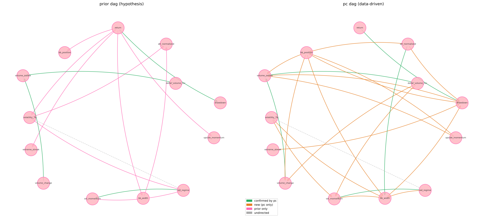

# UNDER CONSTRUCTION

# Causal Feature Validation Framework: Quantifying Overfitting Risk in Financial ML


## Overview

Marcos López de Prado argues that most machine learning models in finance fail not because of model complexity, but due to **spurious features**, statistical relationships that do not reflect the true data-generating process.

This project studies feature engineering as a **causal inference problem**. Instead of relying on correlation, it uses causal discovery as a guardrail to distinguish meaningful structure from noise and reduce the risk of overfitting.

To address limitations of time-based sampling, the analysis is conducted on **dollar bars**, which sample observations based on traded value rather than clock time. This aligns the data with actual market activity, reduces heteroskedasticity, and improves the statistical quality of the input.

---

### Research Question

*Which feature relationships survive causal testing and what does the gap between assumed and validated structure tell us about overfitting risk in financial ML?*

### Methodology

- **Feature Engineering based on EDA** preparing features for causal studies
- **Correlation analysis** baseline feature selection, autocorrelation acf/pacf
- **Stationarity Testing** ADF, 
- **Causal Discovery** Lingam, PC
- **Machine Learning** Triple Barrier Labeling, Random Forest, MDI/MDA


### Key Finding


---


## Market Context: ETH Profile

### Distribution Characteristics 

- **Slight positive mean return** (0.0275%) with **positive median** (0.0630%) indicates weak bullish drift in the sample period  
- **Moderate volatility** (2.22% per bar) suggests more stable distribution compared to time bars  
- **Low Sharpe ratio** (0.35 annualized) reflects weak but positive risk-adjusted performance  
- **Near-symmetric distribution** (skewness -0.03) indicates no strong directional asymmetry  
- **Low excess kurtosis** (1.34) suggests fewer extreme events than a normal heavy-tailed crypto return regime would typically imply  

1. **Histogram with Quantiles:** 25%, 50%, 75% thresholds and tail structure  
2. **Q-Q Plot:** Normality diagnostics for model assumptions  
3. **Box Plot:** Outlier structure and dispersion under event-based sampling  
4. **Rolling Volatility:** Stability of variance across market activity regimes   

  

### Risk Structure 

- **Near-symmetric returns (skewness -0.03)** indicate balanced upside/downside distribution, with no strong directional asymmetry  
- **Low excess kurtosis (1.34)** suggests fewer extreme deviations compared to typical time-bar crypto returns, indicating a more stable event-based distribution  
- **Moderate interquartile range** (Q1: -1.36%, Q3: 1.40%) reflects constrained dispersion under equal-value sampling  

### Tail Risk Profile
- **VaR 95%: -3.68%** indicates moderate downside risk per dollar-activity event  
- **VaR 99%: -5.45%** captures rare but meaningful tail losses under high-activity regimes  

### Implications for Analysis Design

**For Correlation Analysis:**
- Reduced tail heaviness improves stability of linear correlation estimates, but non-linear dependencies may still dominate  
- Symmetric return structure reduces bias toward directional effects, making regime-based features more important than simple return signals  
- Volatility remains a primary driver of feature importance across market activity cycles  

**For Causal Discovery:**
- Lower skewness reduces asymmetry bias in causal direction inference between return variables  
- Remaining kurtosis indicates that extreme events still exist, but are less dominant structural drivers than in time-bar data  
- Causal structure is more likely driven by **activity regimes and volatility persistence** than isolated crash events  
---


## Feature Taxonomy Prioritized by Distribution Structure

This feature taxonomy maps distributional properties of the return series (computed on dollar bars) to relevant feature families. The goal is to structure feature engineering around observed statistical regimes.

| **Domain** | **Features** | **Interpretation under Dollar Bars** |
|------------|--------------|--------------------------------------|
| **Volatility** | volatility_7d, vol_momentum, vol_expansion | Activity-conditioned volatility regimes reflecting changes in market participation intensity |
| **Risk** | drawdown, var_breach_95, tail_risk_signal | Tail risk per unit of traded value rather than time-based event frequency |
| **Extremes** | extreme_down, extreme_streak, reversal_setup | Non-linear shocks exist but are less dominant due to reduced kurtosis and sampling noise |
| **Technical** | rsi, bb_width, atr_normalized | Proxies for latent market state dynamics and regime transitions |
| **Volume** | volume_change, volume_zscore, volume_spike | Direct measure of information flow and market activity intensity |

---

### Correlation Analysis

- **Pros:** Simple, fast, reduces multicollinearity
- **Cons:** Ignores causal structure, risks discarding valuable mediators, may miss asymmetric relationships
- **Return-correlation based removal:** Names the less predictive feature from each correlated pair
- **Limitation:** Linear correlation may miss regime-dependent relationships critical in high-volatility environments

  

**Key Empirical Findings:**


### Causal Discovery as Feature Engineering Guardrail

**Pros:** Uncovers directional dependencies, preserves signal hierarchies, captures asymmetric patterns
- **Cons:** Computationally demanding, manual dag requires strong assumptions
- **Method:** Uses manual discovery as well as causal discovery algorithms (PC Algorithm, FCI)

**Objectives:**
- Identify **leading indicators** vs. **lagging confirmations** (critical for regime changes)
- Understand **propagation chains** (e.g., extreme_events → volatility_spike → behavioral_shifts)
- Avoid **data leakage** by excluding the target from the DAG
- Build **interpretable signal hierarchies** that account for asymmetric market behavior

**Enhanced Focus Areas:**
- **Volatility clustering patterns:** How do high-volatility periods self-perpetuate?
- **Regime transition signals:** What triggers moves from low to high volatility states?
- **Asymmetric response patterns:** Different causal pathways for positive vs. negative extreme moves
- **Tail risk propagation:** How do VaR breaches influence other risk indicators?

**Warning:** Using the target in the DAG creates look-ahead bias.

**Solutions:**
- **Option A:** Remove `return` entirely from causal graph
- **Option B:** Use **lagged returns** (return_t-1 → return_t) with proper temporal separation

**Note:** Causal graphs serve as **heuristics for signal architecture** informed by empirical return characteristics, not definitive causal truth.


**PC Algorithm**


  

The algorithmic approach (37 indicators, 66 relationships) reveals additional insights:

*Leading Indicators:* `vol_momentum` (6 outgoing connections), `vwap_distance` (4 connections) emerge as top causal drivers - validating volatility clustering importance

*Risk Aggregators:* `drawdown` (5 incoming connections), `volume_zscore` (4 incoming) serve as key risk consolidation nodes

*Lag Feature Over-influence:* OHLC lag features show 3+ connections each, confirming correlation analysis concerns about redundancy

*Volume-Volatility Hub:* `volume_zscore` (6 total connections) emerges as central mediator between volume dynamics and volatility regime shifts


**Lingam Algorithm**

 
  

### Hybrid Optimization (Empirically-Informed Feature Selection)

Based on the causal validation results, the final feature set is constructed 
to maximize signal integrity and minimize overfitting risk:

1. **Preserve algorithmic hubs** like `vol_momentum` (6 connections) and `volume_zscore` (6 connections) as core features
2. **Apply selective lag pruning** - reduce OHLC lag redundancy from 5 to 1-2 most predictive features based on PC Algorithm over-connectivity warning
3. **Maintain risk consolidation pathways** - preserve `drawdown` → risk cascade despite correlation flagging
4. **Balance computational efficiency** with causal completeness using algorithmic connection counts as feature importance weights

 


**Kelly Strategy**

 


## Granger Causality Validation

To validate the causal relationships discovered by the PC Algorithm, we applied **Granger causality tests** to identify features with genuine predictive power.

**Results:**
- **Only 3 features** showed significant Granger causality (p < 0.05) toward returns:
  - `bb_lower` (p=0.041) - Bollinger Band lower bound
  - `open_lag1` (p=0.048) - Lagged opening price  
  - `low_lag1` (p=0.049) - Lagged low price

**Critical Finding:** Only 3 of ~40 PC Algorithm features survive Granger 
validation, meaning 92.5% would have entered a model as spurious signals. 
This is the quantified overfitting risk that López de Prado's framework is 
designed to prevent. The 3 validated features (bb_lower, open_lag1, low_lag1) 
represent the structurally sound core of the feature set.

**Implications:**
- **PC Algorithm as filter:** The 66 discovered relationships 
  required Granger validation, algorithmic discovery narrows the search space 
  but does not replace statistical testing. Both layers are necessary.
- **Lag feature validation:** 2 of 3 significant features are lag prices, supporting the "price leads price" hypothesis
- **Technical indicator sparsity:** Only 1 technical indicator (`bb_lower`) shows genuine causal predictive power


---

## Key Learnings: When Causal Discovery Adds Value

1. Network Hub Identification

- PC Algorithm successfully identified central features (vol_momentum, volume_zscore with 6+ connections)

- Validated benefit: Prioritizes features with maximum structural influence
- Business value: Focus computational resources on highest-impact variables

2. Redundancy Detection Enhancement

- Over-connectivity analysis flagged OHLC lag feature redundancy (3+ connections each)
- Validated benefit: Confirms correlation analysis with structural reasoning
- Business value: More confident feature elimination decisions

3. Risk Consolidation Mapping

- Identified drawdown as primary risk aggregation node (5 incoming connections)
- Validated benefit: Reveals which features serve as risk concentration points
- Business value: Better risk monitoring and stress testing design

**Use Causal Discovery For:**

- Feature prioritization (identify hubs for computational focus)
- Redundancy validation (confirm correlation-based elimination)
- Risk architecture (map stress propagation pathways)
- Leakage Discovery in your Features 


**Bottom Line:** This project quantifies what López de Prado argues theoretically: 
domain knowledge alone produces ~85% false positives in feature construction. 
Causal discovery is not a prediction tool, it is an overfitting prevention 
mechanism. Used as a guardrail before model training, it systematically removes 
the spurious correlations that cause convincing backtests to fail in production.

## Relevance to Blockchain Behavior & Risk Analysis

Causal discovery can help identify risk propagation chains such as:
- Transaction clustering patterns
- Smart contract interaction effects  
- Exchange flow dynamics

Example causal chain:
```
sudden_token_inflow → liquidity_stress → price_dislocation → user_exit_behavior
```

This makes it relevant for:
- **Anomaly detection** (e.g., identifying unusual market structure changes)
- **Risk attribution** (e.g., tracing volatility spikes back to on-chain triggers)  
- **Protocol monitoring** (e.g., structural shifts in user behavior patterns)


## Usage
```bash
bashgit clone [repository]
pip install -r requirements.txt
jupyter notebook inference_and_causality.ipynb
```