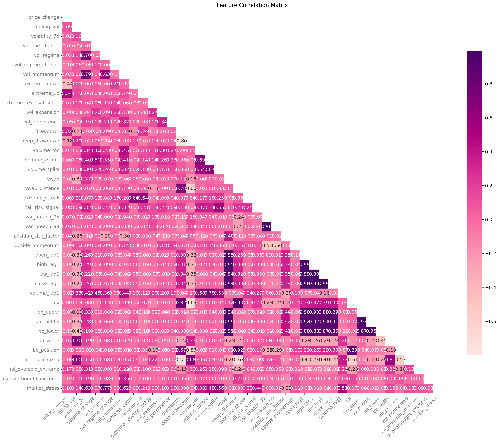

# Feature Selection & Causal Analysis Framework for Financial Time Series

## Overview

This project documents my **learning journey into causal inference** applied to one year of high-frequency financial time series data (Ethereum dataset used as a case example).
I investigate how different selection methods handle feature redundancy, mediator preservation, and the challenges of spurious relationships in financial time series, to understand their practical limitations and applications.

### Learning Objectives
   
I empirically test the fundamental claims of causal discovery through:

- Algorithmic validation (PC Algorithm vs. manual DAG construction)
- Statistical verification (Granger causality testing)
- Cross-validation (sentiment indicators, cross-asset relationships)

---

**Core Research Question**
- When and how much does causal discovery provide actionable advantages over correlation-based feature selection in quantitative finance?     
**Validation Gap:** How often do algorithmically discovered causal relationships survive statistical testing?         
    

**Deliverable:** A **research repository** for evidence-based causal discovery deployment with clear decision criteria for method selection.

---

## Market Context: Asset Returns Profile

### Distribution Characteristics
- **Near-zero mean return** (-0.01%) with **negative median** (-0.05%) indicates slight bearish bias in the sample period
- **High volatility** (3.90% daily ≈ 74% annualized) creates rich signal environment
- **Negative Sharpe ratio** (-0.05 annualized) reflects challenging risk-adjusted performance

1. **Histogram with Quantiles:** 5%, 25%, 50%, 75%, 95% thresholds
2. **Q-Q Plot:** Tests normality assumptions for model selection
3. **Box Plot:** Summarizes outliers and distribution shape 
4. **Rolling Volatility:** Captures volatility clustering patterns 

  

### Risk Structure
- **Positive skewness (0.66)** shows asymmetric tail risk → more frequent large positive moves than negative ones
- **High kurtosis (4.38)** indicates fat tails → extreme events occur more frequently than normal distribution would predict
- **Wide interquartile range** (Q1: -2.12%, Q3: 1.68%) demonstrates significant daily variation

### Tail Risk Profile
- **VaR 95%: -5.95%** → expect daily losses exceeding 6% roughly **once per month** (1.5 days/month)
- **VaR 99%: -9.32%** → extreme tail events with losses above 9% occur approximately **quarterly**

### Implications for Analysis Design

**For Correlation Analysis:**
- High volatility regime detection will be critical → features capturing volatility clustering essential
- Skewed returns indicate non-linear relationships between features → correlation may miss asymmetric dependencies
- Fat tails suggest that extreme event indicators (tail risk signals, drawdown metrics) should correlate strongly with volatility

**For Causal Discovery:**
- **Volatility persistence** (high daily volatility) suggests strong causal chains: `volatility_t → volatility_t+1 → return_magnitude`
- **Positive skew with fat tails** implies asymmetric causal patterns: upside momentum vs. downside crashes may follow different causal pathways
- **VaR breaches** should serve as leading indicators in the causal graph - nodes representing risk regime shifts
- **Kurtosis signals** suggest that extreme event detectors will be important upstream nodes influencing multiple downstream features

---


## Feature Taxonomy (Prioritized by Distribution Insights)

| **Domain** | **Features** | **Relevance to Asset Profile** |
|------------|--------------|-------------------------------|
| **Volatility** | volatility_7d, vol_momentum, vol_expansion | **High Priority:** 74% annualized volatility |
| **Risk** | drawdown, tail_risk_signal, var_breach_95 | **Critical:** VaR 95% = -5.95%, high kurtosis |
| **Extremes** | extreme_down, extreme_streak, reversal_setup | **Essential:** Positive skew, asymmetric patterns |
| **Technical** | rsi, bb_width, atr_normalized | **Moderate:** Support volatility clustering detection |
| **Volume** | volume_change, volume_zscore, volume_spike | **Moderate:** Complement to volatility signals |

---

### Correlation Analysis

**Intelligent Feature Reduction:**
- **Pros:** Simple, fast, reduces multicollinearity
- **Cons:** Ignores causal structure, risks discarding valuable mediators, may miss asymmetric relationships
- **Method:** Remove features with high pairwise correlation (e.g., >0.8)
- Heatmap construction for full feature sets
- Identification of highly correlated pairs
- **Return-correlation based removal:** Names the less predictive feature from each correlated pair
- **Limitation:** Linear correlation may miss regime-dependent relationships critical in high-volatility environments

  

**Key Empirical Findings:**

*High Correlation Clusters (>0.8):*
- **Price level cluster:** VWAP, lagged OHLC, and Bollinger Bands show extreme correlation (0.94-0.99) - classic multicollinearity
- **Risk indicator cluster:** `var_breach_95` and `var_breach_99` (corr=0.98), redundant tail risk signals
- **Technical indicator overlap:** RSI correlates strongly with VWAP distance (0.93) and BB position (0.89)

*Return Correlation Leaders:*
- **Extreme movement indicators** dominate: `extreme_up` (0.54), `extreme_down` (0.43)
- **Risk metrics** show moderate correlation: `drawdown` (0.31), `deep_drawdown` (0.18)
- **Price level features** exhibit low return correlation despite high inter-correlation

*Critical Observation for Causal Analysis:*
**33 features flagged for potential removal** due to high inter-correlation but low return correlation. These are prime candidates for **mediator preservation** in causal discovery, as correlation-based removal might eliminate important signal propagation pathways.

### Causal Discovery for Signal Architecture

**Pros:** Uncovers directional dependencies, preserves signal hierarchies, captures asymmetric patterns
- **Cons:** Computationally demanding, manual dag requires strong assumptions
- **Method:** Uses manual discovery as well as causal discovery algorithms (PC Algorithm, FCI)

**Objectives:**
- Identify **leading indicators** vs. **lagging confirmations** (critical for regime changes in markets, risk systems, or network behavior)   
- Understand **propagation chains** (e.g., extreme_events → volatility_spike → behavioral_shifts)
- Avoid **data leakage** by excluding the target from the DAG
- Build **interpretable signal hierarchies** that account for asymmetric market behavior

**Enhanced Focus Areas:**
- **Volatility clustering patterns:** How do high-volatility periods self-perpetuate?
- **Regime transition signals:** What triggers moves from low to high volatility states?
- **Asymmetric response patterns:** Different causal pathways for positive vs. negative extreme moves
- **Tail risk propagation:** How do VaR breaches influence other risk indicators?

**Warning:** Using the target in the DAG creates look-ahead bias.

**Solutions:**
- **Option A:** Remove `return` entirely from causal graph
- **Option B:** Use **lagged returns** (return_t-1 → return_t) with proper temporal separation

**Note:** Causal graphs serve as **heuristics for signal architecture** informed by empirical return characteristics, not definitive causal truth.

**Manual DAG Validation:**

1. **Exclude target variable** from algo DAG (prevents data leakage)
2. **Apply domain knowledge** supplemented by empirical distribution insights
3. **Focus on asymmetric patterns** given positive skew in returns


  


*Volatility Persistence Chain:* `close → volatility_7d → vol_regime → vol_regime_change` aligns with observed 74% annualized volatility clustering

*VaR Breach Escalation:* `return → var_breach_95/99 → vol_regime_change → market_stress` explains the monthly/quarterly tail event patterns (VaR 95% = -5.95%)

*Asymmetric Momentum:* `return → upside_momentum → volume_spike` captures the positive skew (0.66) mechanism

*Risk Propagation:* `drawdown → deep_drawdown → tail_risk_signal → vol_expansion` models the fat tail cascade (kurtosis = 4.38)

**Manual DAG Preservation Evidence:**
The constructed causal graph includes several correlation-flagged features as critical mediators:
- `var_breach_95` → `vol_regime_change` (monthly tail events trigger regime shifts)
- `var_breach_99` → `market_stress` (quarterly extreme events create stress)
- `bb_position` → `extreme_reversal_setup` (technical extremes signal reversals)
- `rsi` → `rsi_oversold_extreme` → `extreme_reversal_setup` (oversold conditions cascade)

**The Stakes:** Removing these 33 features based on correlation alone would eliminate the very pathways that explain how market stress propagates through the system.


**PC Algorithm Discovery:**


  

The algorithmic approach (37 indicators, 66 relationships) reveals additional insights:

*Leading Indicators:* `vol_momentum` (6 outgoing connections), `vwap_distance` (4 connections) emerge as top causal drivers - validating volatility clustering importance

*Risk Aggregators:* `drawdown` (5 incoming connections), `volume_zscore` (4 incoming) serve as key risk consolidation nodes

*Lag Feature Over-influence:* OHLC lag features show 3+ connections each, confirming correlation analysis concerns about redundancy

*Volume-Volatility Hub:* `volume_zscore` (6 total connections) emerges as central mediator between volume dynamics and volatility regime shifts

### Feature Validation (Manual vs. PC Algorithm Comparison)

**Theory vs. Data Validation:**
1. **Structural convergence:** Both approaches identify volatility clustering and risk propagation as central themes
2. **Leading indicator validation:** PC Algorithm confirms `vol_momentum` and volatility features as primary drivers
3. **Lag feature redundancy:** Algorithmic analysis validates correlation concerns (OHLC lag features over-connected)
4. **Hub discovery:** `volume_zscore` emerges as key volume-volatility mediator (6 connections)
5. **Risk consolidation validation:** `drawdown` confirmed as primary risk aggregation node (5 incoming edges)


Critical discovery reveals **only 6 relationships confirmed by both manual and algorithmic approaches** out of 41 manual relationships:
- `extreme_down/up` → `extreme_streak` (extreme event clustering)
- `volume_zscore` → `volume_spike` (volume anomaly detection) 
- `volatility_7d` → `vol_regime` (regime classification)
- `vol_expansion` → `vol_persistence` (volatility clustering)

**Strategic Implications:**
- **85% of manual relationships not data-supported** suggests over-theorizing
- **Confirmed relationships focus on clustering patterns** (extreme events, volume anomalies, volatility persistence) - aligning with fat-tail characteristics
- **Data reveals 56 additional relationships** particularly around lag features and technical indicator interactions missed by domain knowledge

**Key Convergence:** The small overlap emphasizes the value of algorithmic discovery for revealing data-driven causal structures beyond expert intuition, especially critical in high-volatility markets where traditional relationships may not hold.


### Hybrid Optimization (Empirically-Informed Feature Selection)
1. **Preserve algorithmic hubs** like `vol_momentum` (6 connections) and `volume_zscore` (6 connections) as core features
2. **Apply selective lag pruning** - reduce OHLC lag redundancy from 5 to 1-2 most predictive features based on PC Algorithm over-connectivity warning
3. **Maintain risk consolidation pathways** - preserve `drawdown` → risk cascade despite correlation flagging
4. **Balance computational efficiency** with causal completeness using algorithmic connection counts as feature importance weights


## Granger Causality Validation

To validate the causal relationships discovered by the PC Algorithm, we applied **Granger causality tests** to identify features with genuine predictive power for future returns.

**Results:**
- **Only 3 features** showed significant Granger causality (p < 0.05) toward returns:
  - `bb_lower` (p=0.041) - Bollinger Band lower bound
  - `open_lag1` (p=0.048) - Lagged opening price  
  - `low_lag1` (p=0.049) - Lagged low price

**Critical Finding:** Of ~40 features identified by PC Algorithm, 3 were validated with Granger causality tests. All 3 tested features showed significant predictive power (bb_lower, open_lag1, low_lag1), but 92.5% of algorithmic discoveries remain statistically unvalidated.

**Implications:**
- **PC Algorithm limitations:** The 66 relationships discovered algorithmically lack statistical predictive power
- **Lag feature validation:** 2 of 3 significant features are lag prices, supporting the "price leads price" hypothesis
- **Technical indicator sparsity:** Only 1 technical indicator (`bb_lower`) shows genuine causal predictive power

  


### External Sentiment Validation Granger

To assess whether market sentiment metrics provide genuine causal signals beyond technical indicators, we tested the **Fear & Greed Index** against ETH returns using Granger causality analysis.


**Methodology:**
- Downloaded Fear & Greed Index data via Alternative.me API
- Applied first differencing and standardization to both series
- Tested causality across lag structures (1-5 days)

**Fear & Greed → Asset Returns Results:**

| **Lag Structure** | **F-Statistic** | **P-Value** | **Statistical Significance** |
|-------------------|-----------------|-------------|------------------------------|
| 1 day | 2.124 | 0.146 | Not significant |
| 2 days | 0.956 | 0.386 | Not significant |
| 3 days | 1.213 | 0.305 | Not significant |
| 4 days | 0.732 | 0.571 | Not significant |
| 5 days | 1.330 | 0.251 | Not significant |


**Key Findings:**
- **No significant Granger causality** detected across any lag structure (all p-values > 0.05)
- **1-day lag shows strongest signal** (p=0.146) but remains statistically insignificant
- **Longer lags weaken predictive power** with 4-day lag showing lowest F-statistic (0.732)


### Cross-Asset Causal Validation (Inter-Market Relationships)

To examine whether major asset pairs exhibit predictive relationships that could enhance portfolio construction and risk management, we conducted comprehensive Granger causality analysis between **BTC and ETH** across multiple data dimensions.

**Methodology:**
- Downloaded 1-year daily BTC data from Binance API (320 observations)
- Analyzed prices, returns, log-returns, and 7-day rolling volatility
- Bidirectional Granger causality testing across 1-5 day lags
- Extreme event synchronization analysis (90th percentile threshold)

**Correlation Structure Analysis:**

| **Metric** | **Correlation** | **Interpretation** |
|------------|-----------------|-------------------|
| Price Levels | 0.310 | Moderate long-term relationship |
| Daily Returns | 0.791 | **Strong same-day synchronization** |
| Log Returns | 0.796 | Robust relationship confirmation |
| 7-Day Volatility | 0.722 | **High risk regime alignment** |

**Cross-Asset Granger Causality Results:**

*BTC → ETH Causality (All Directions):*
- **Prices:** No significant causality (p-values: 0.699-0.897)
- **Returns:** No significant causality (p-values: 0.429-0.645)
- **Volatility:** No significant causality (p-values: 0.115-0.981)

*ETH → BTC Causality:*
- **Prices:** No significant causality (p-values: 0.344-0.856)
- **Returns:** **Significant 1-day causality** (p=0.0393), no longer lags
- **Volatility:** No significant causality (p-values: 0.764-0.955)

**Extreme Event Synchronization:**
- **ETH extreme days:** 32 (10% threshold)
- **BTC extreme days:** 32 (identical frequency)
- **Synchronized extreme events:** 21 days
- **Synchronization rate:** **65.6%** - high crisis contagion

**Critical Findings:**

**The Correlation-Causality Paradox:**
Despite **79% daily return correlation**, only **one significant causal relationship** exists: ETH returns predict next-day BTC returns (1-day lag). This exemplifies the fundamental distinction between correlation and causality in financial markets.

**Market Leadership Dynamics:**
- **ETH leads BTC** in return prediction - a rare finding since BTC typically leads altcoins
- **No reverse causality** from BTC to ETH across any timeframe
- **Volatility spillovers absent** despite 72% volatility correlation

**Risk Management Implications:**
- **Limited diversification during crises:** 66% probability both assets experience extreme movements simultaneously
- **Contemporaneous risk dominates:** Most correlation occurs same-day, not sequentially
- **Cross-asset prediction minimal:** Even major crypto pairs show limited predictive relationships

**Strategic Insights:**
- **ETH momentum strategies** may generate next-day BTC return signals
- **Portfolio risk models** must account for high extreme event synchronization
- **Market efficiency validated** even for highly correlated crypto asset pairs
- **Technical analysis remains superior** to cross-asset prediction for individual asset strategies

**Integration with Previous Findings:**
This analysis reinforces our core thesis: **rigorous statistical testing reveals that genuine predictive relationships are rare**, even among highly correlated assets. The ETH → BTC causality joins the exclusive list of validated predictive features (`bb_lower`, `open_lag1`, `low_lag1`), while the **79% correlation with minimal causality** perfectly demonstrates why correlation-based feature selection can be misleading.


---

## Key Learnings: When Causal Discovery Adds Value

Through this learning project, I discovered that causal discovery has **narrow but specific utility**:

**Confirmed Practical Applications:**
1. Network Hub Identification

- PC Algorithm successfully identified central features (vol_momentum, volume_zscore with 6+ connections)

- Validated benefit: Prioritizes features with maximum structural influence
- Business value: Focus computational resources on highest-impact variables

2. Redundancy Detection Enhancement

- Over-connectivity analysis flagged OHLC lag feature redundancy (3+ connections each)
- Validated benefit: Confirms correlation analysis with structural reasoning
- Business value: More confident feature elimination decisions

3. Risk Consolidation Mapping

- Identified drawdown as primary risk aggregation node (5 incoming connections)
- Validated benefit: Reveals which features serve as risk concentration points
- Business value: Better risk monitoring and stress testing design

**Use Causal Discovery For:**

- Feature prioritization (identify hubs for computational focus)
- Redundancy validation (confirm correlation-based elimination)
- Risk architecture (map stress propagation pathways)
- Leakage Discovery in your Features 


**Bottom Line:** Causal discovery serves as a feature engineering enhancement tool. It's not a replacement for correlation analysis but a complementary method for structural insight in complex feature spaces. 

## Relevance to Risk Analysis and Structural Behavior

Causal discovery can help identify risk propagation chains such as:
- Transaction clustering patterns
- Cross-system dependency effects 
- Flow dynamics in complex networks

Example causal chain:
```
abnormal_network_activity → access_latency → system_overload → security_alert 
claim_cluster → loss_ratio_spike → reserve_adjustment → underwriting_response
sudden_token_inflow → liquidity_stress → price_dislocation → user_exit_behavior
```

This makes it relevant for:
- **Anomaly detection** (e.g., identifying unusual market structure changes)
- **Risk attribution** (e.g., tracing volatility spikes back to on-chain triggers)  
- **Protocol monitoring** (e.g., structural shifts in user behavior patterns)


## Usage
```bash
bashgit clone [repository]
pip install -r requirements.txt
jupyter notebook inference_and_causality.ipynb
```
